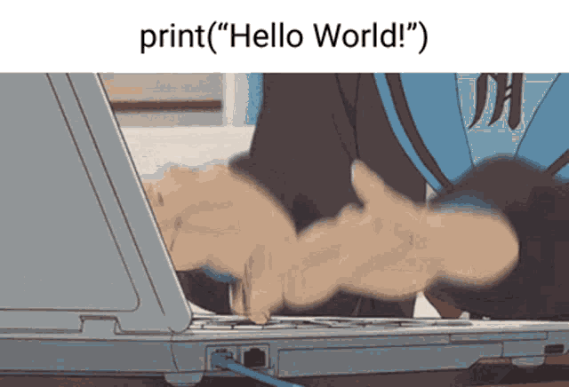

<h3 align="center">
      &lt; Olá, eu me chamo Guilherme Moura /&gt;
</h3>

 
  <samp>
     
    「 Procurando me tornar um desenvolvedor fullstack <b>São Paulo, capital</b> 」
     
     
  </samp>

 

 

<!-- About Section -->

# About me

 
  
 ❤️ &emsp; Amo codar e aprender tudo sobre programação e tecnologia e motivado a aprender qualquer linguagem  
 💬 &emsp; Pergunte-me sobre qualquer coisas [aqui](https://github.com/gumeeee)

 
 
 

## Use To Code

### Frameworks

### Languages

### DB

### Other

 

## Top Open Source

 

 

  

  

<a> 
    
  
   
</a>
